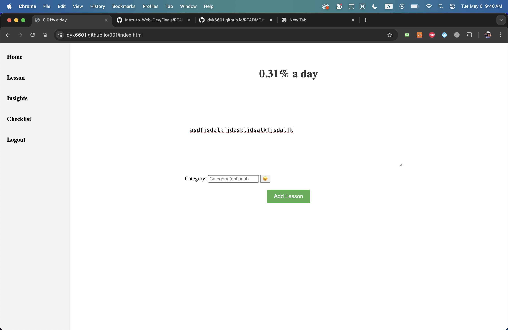
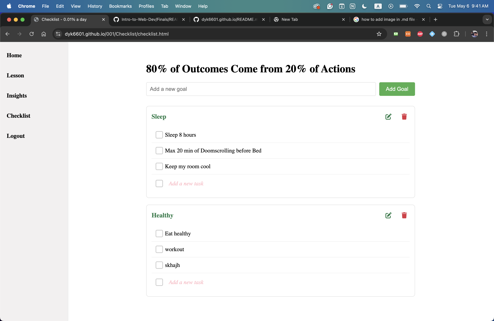

# Final Documentation

Link to website: 
https://dyk6601.github.io/001/index.html

Summary:
My website is a productivity website that focuses on reflection. It is a journal + checklistthat works together in one website.

A code snippet:
Adding a Lesson

    async function addLesson(content, category = "") {
    try {
        const { user, error: authError } = await checkAuth();
        if (authError || !user) {
            alert('Please log in to add a lesson');
            showLoginUI();
            return;
        }

        showLoading(loadingIndicator);
        submitButton.disabled = true;

        const { data, error } = await supabase
            .from('lessons')
            .insert([
                { 
                    content: content,
                    category: category,
                    created_at: new Date().toISOString(),
                    user_id: user.id
                }
            ]);

        if (error) throw error;
        
        // Update the percentage with animation
        const today = new Date().toDateString();
        const storedDate = localStorage.getItem('lastLessonDate');
        const storedPercentage = localStorage.getItem('currentDailyPercentage');
        
        if (storedDate !== today) {
            const randomPercentage = (Math.random() * (0.50 - 0.20) + 0.20).toFixed(2);
            localStorage.setItem('lastLessonDate', today);
            localStorage.setItem('currentDailyPercentage', randomPercentage);
            if (dailyPercentageElement) {
                animatePercentageChange(0.01, randomPercentage, dailyPercentageElement);
            }
        } else if (dailyPercentageElement) {
            animatePercentageChange(0.01, storedPercentage, dailyPercentageElement);
        }

        alert('Lesson added successfully!');
        lessonForm.reset();
        await loadLessons();
    } catch (error) {
        console.error('Error adding lesson: ', error);
        alert('Error adding lesson. Please try again.');
    } finally {
        hideLoading(loadingIndicator);
        submitButton.disabled = false;
    }
}

# What you struggled with:
I struggled to do finish my website to be working. There were so many errors when i try to impliment new functions to my website. So i learned a lot about throwing errors do determine where the error was happening. 

# What you’re proud of
I'm very proud of the lessons page. Being able to add lessons and delete lessons using an online database utilising my sql skills

# What you would add next if you had more time
I would make the website more asthetic and fix my insights code